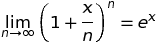

<h4 align="center">ON COMPOUNDING</h4>

<h5 align="center"> 1. Foundation </h5>

A *compounding period* consists of a time interval and a fixed interest rate
which is applied to the value of a financial account at the beginning
of the interval, the accrual of which is added to the account at end of the interval.
For the sake of exposition, we will only consider
time intervals of equal length which are shorter than a year.
Although this eliminates "months" as possible compounding periods,
it will be clear to the reader as to how to modify the discussion appropriately, 
if desired.  The interest rate, *r*, is assumed to be annual, and is
prorated over any compounding period. A year is divided into *n* identical
intervals, such as days, hours, minutes, etc.

If *p* denotes the initial principle in the account, and *ai*
is the account value at the end of the *i th* compounding period,
let *a0* = *p*, for consistency.  Then

<i>
a1 = a0 + a0(r &frasl; n)
= a0 (1 + r &frasl; n).
</i>

Likewise,

<i>
a2 = a1 (1 + r &frasl; n) 
= a0 (1 + r &frasl; n)2.
</i>

Continuing in this manner, the account value at the end of a year is equal to

<i>
an = p(1 + r &frasl; n)n.
</i>

The greater *n* becomes, the smaller *r &frasl; n* becomes, so the expression inside
the parentheses gets closer to 1, and although the exponent is getting larger,
1 raised to any power remains equal to 1.  So what happens to the value of
the exponential portion of the expression for *an* as the number of
compounding periods increases, or equivalently, the compounding intervals become
shorter in time?  Before we can perform any numerical calculations, a specific rate of interest is required, so letsassign *r* = .05, that is, 5 percent.
The following table is of interest because it suggests that as *n* becomes unboundedly large, the expression appears to actually approach a finite value.  The last row
follows from one of the most celebrated equations in all of calculus:

where the number *e*, sometimes referred to as Euler's constant, is the *base of natural
logarithms*, and its inverse function, is the *exponential* function of calculus.  Thus,
the number in the third column of the bottom row of the table is *e .05*, rounded off to 9 decimal places.

| *type of compounding* | *number of compounding periods* | *(1 + .05 &frasl; n)n* |
| :---: | :---: | :---: |
| annually | 1           | 1.050000000 |
| semi-annually | 2      | 1.050625000 |
| quarterly | 4          | 1.050945337 |
| weekly | 52            | 1.051245842 |
| daily | 365            | 1.051267496 |
| hourly | 8760          | 1.051270946 |
| continuously | &infin; | 1.051271096 |

A *continously,* or *instantaneously, compounded (annual) rate, r*,
hereafter referred to as a *ccrate*, satisfies the equation

<i> a = pert, </i>

where *a* is that account value at the end of *t* years, and *p* is the initial principal.  The table suggests that, broadly speaking, for "small" interest rates
which are compounded "frequently",
*a* and *an* do not differ by very much.  For example,
if $100,000 is invested at 5% for a year, weekly compounding returns $105,124.58 while continuous compounding yields $105,127.11, a difference of only $2.53.

A CD with the following policy was recently advertised: "interest computed daily and added monthly".  This is simply slick marketing to make unwary investors think
they would be getting something better than monthly compounding. *UH UH!*  By this point in our discussion, you know that

<i> the power of compounding lies in the frequency of the addition of accrued interest. </i>

    
The table above shows that although the difference may hardly be noticed by many investors,
the institution borrowing millions of dollars worth of CDs is probably saving some
"serious" money with this type of offer.  *Caveat Emptor*.

We next consider the inverse problem: calculate the *ccrate* when given *p* and
the payoff over a time period, *t*.  For example, what is the *ccrate* which returns $105 after a year
for an investment of $100?
Note that 5% is the obvious answer when compounding occurs annually.  The *ccrate* is almost as easy:
it is that value of *r* which satisfies the equation

<i>105 = 100er,</i>

or

<i>r = ln(105 &frasl; 100) = 4.88%,</i>

    
where *ln* is the symbol for the natural logarithm function, a standard feature on almost
any hand calculator.  As expected, it is smaller than the annual rate, and close in
value.  Because *ccrates* are defined in terms of exponentials, which are generally easier
to work with than powers, *ccrates* are used to provide an answer to the scenario presented
in the next section.

<h5 align="center"> 2.Extension </h5>

Consider an account allowing both deposits and withdrawals at any time.  Furthermore, it is possible
to ascertain the value of the account at any time after it has been established, e.g., a mutual fund.
What is the *ccrate* at any particular time?  This is a natural question to ask because
it provides a measure of how well the account is performing, providing an independent
check of what you see in your account statements.  We will demonstrate how to do this without requiring any deeper knowledge of calculus than what has already been used
in the discussion so far.

Suppose we invest $1000 as the initial principal, and withdraw $50 after 6 months.  If the payoff at
year's end is $950, what is the *ccrate* rate for such an investment?
This answer is obvious: 0% because $1000 - $50 = $950 is true independent of any consideration
of interest rates.  But what if the return is $1000?  Now, an intrest rate is needed which
generates enough interest over the last 6 months to replace the $50 that is removed at midyear, but which is
active over the course of the entire year.  If *r* represents this continuous interest rate,
the value of the account at midyear, prior to the withdrawal, is equal to
1000*e*0.5*r*
because the interest rate is prorated over the first 6 months, and thus, the amount in the account at the
beginning of the final 6 months is 1000*e*0.5*r* - 50.  Therefore, the following
equation

<i> (1000e0.5r - 50)e0.5r = 1000 </i>

must be solved for *r*, but *r* generally does not have a closed form
solution for this class of equations,
unlike the simple situation above in which the natural logarithm was
available.  However, it is possible to find an approximate solution to any desired degree
of accuracy, but the algorithm depends on mathematics
\[[documentation](https://github.com/NYgramps/ccrate/blob/master/DOC.md)\] 
more advanced than many readers
may be familiar with.  Consequently, a browser application has been written, hiding
the mathematics in the background,
coded in plain vanilla javascript, which solves these types of problems
and runs offline.  It can be downloaded from [github](https://github.com/NYgramps/ccrate).
The answer supplied by this application is _r\*_ = 5.02%.  If

<i> &phi;(r) = 1000er - 50e0.5r -
    1000, </i>

it is easy to verify that &phi;(_r\*_) = 0.21, indicating that _r\*_ is close in value
to the ideal, exact root of &phi;(). This knowledge is useful when evaluating the
performance of an investment.
