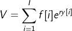
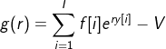
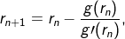

When viewed in a browser, *ccrate.html* provides a web page to compute **continously compounded rates** for financial investments having credits and debits, that is, a *flow* over time, e.g. tax-deferred retirement accounts requiring withdrawals (RMDs) after the age of 70.5.  The equation used to define this type of rate, *r*, over a single flow period is

<i>value = principal &#215; ert</i>

where *principal* is the investment value at the beginning of the period, and *value* is the investment value after *t* years.  In this case, *r* has a closed form solution in terms of the natural
logarithm of calculus.

Next consider the case of 2 flow amounts, *f[1]* occurring on date *d[1]*
preceding *f[2]* occurring on date *d[2]*.  Denoting the time intervals
*t[1]* = [*d[1]*, *d[2]*] and *t[2]* = [*d[2]*, *D*], and *V* the investment
value on *D*, it follows that

   
<i>V = ( f[1] ert[1] + f[2] ) ert[2] = f[1] er(t[1] + t[2]) + f[2] ert[2]</i>.

Note that *t[1] + t[2]* is the time interval [*d[1]*, *D*].  More generally, if there is a sequence of flow amounts, *{f[i]}*, occurring on the dates, *{d[i]}*, for *i=1,...,I*,
the above equation becomes

where *y[i]* equals the time interval [*d[i], D*] in years.  Although there is no closed-form solution for *r*, the *Newton-Raphson* numerical method can be used to generate successively improving appoximations of the root of

to a high degree of accuracy after only a few iterations of the formula

initializing *r*1 with a guess of the root value, and *g&prime;(r)* denoting the *derivative* of *g(r)*.

So a **continuously compounded rate**, denoted **_ccrate_**, is yet another measure of the performance of such an investment over its lifetime, accounting for all deposits and withdrawals.  Indeed, even maintenance and/or advisory fees would be accounted for implicitly for certain types of financial investments dependent on market value. **_ccrate_** can be thought of as an extension of the usual concept of interest rate.  It is a very good appoximation of interest rates compounded with at least a monthly frequency, and is easier to work with because it is defined in terms of the standard exponential
function of calculus, <i>exp()</i>, which has many nice mathematical properties.

